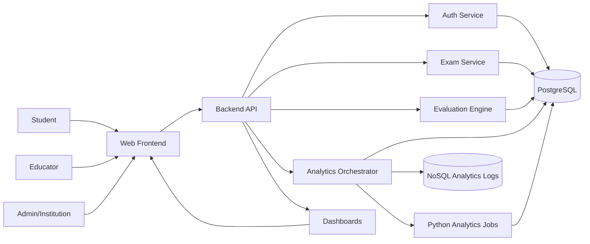

# System Architecture

## High-level overview
The platform converts question-level exam responses into actionable academic intelligence. It collects raw exam data, evaluates results, runs analytics, and presents insights to students, educators, and institutions.

## Clean, layered architecture diagram

## Data flow and integration points
1. Frontend sends authenticated requests to Backend API.
2. Auth service validates credentials and issues JWT tokens.
3. Exam service manages exams, questions, and attempts.
4. Evaluation engine scores attempts and writes results.
5. Analytics orchestrator triggers batch/near-real-time analytics.
6. Python analytics jobs aggregate results and store summaries.
7. Dashboards read summaries for student, educator, and admin views.
